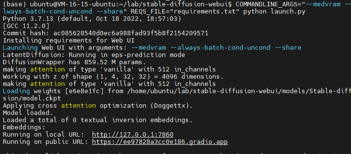
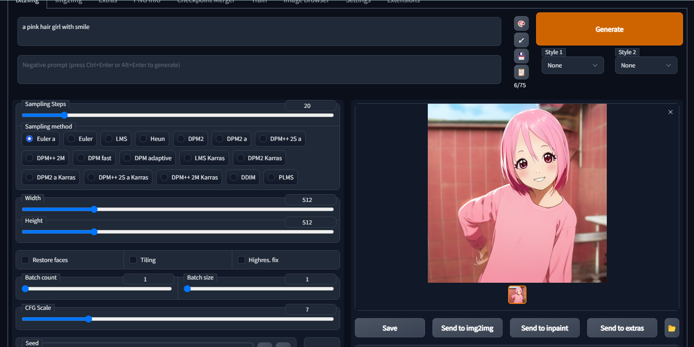

### 服务器配置
使用腾讯云T4显卡服务器

ubuntu服务器配置anaconda：https://cloud.tencent.com/developer/article/1649008

## LINUX stable-diffusion-webai部署：

repo：https://github.com/AUTOMATIC1111/stable-diffusion-webui

主要的部署是参考下文，十分的详细，适合新手。
参考流程:https://zhuanlan.zhihu.com/p/574200991


```shell
#启动命令
COMMANDLINE_ARGS="--medvram --always-batch-cond-uncond --share" REQS_FILE="requirements.txt" python launch.py
```
部署完输入启动命令,启动后会显示一个链接ctrl点击进入



进入网页后随意实现一张作画，质量还是可以的



#### 坑:
腾讯云的账户不是root，在git clone有时候会 gnutls_handshake() failed: The TLS connection was non-properly terminated.

- git 文件权限转让 sudo
```shell
# 查看当前文件夹权限
ls -la

# 修改当前页面所有文件权限
sudo chown -R ubuntu:ubuntu .
```
- git代理设置重置    
```shell

git config --global  --unset https.https://github.com.proxy 

git config --global  --unset http.https://github.com.proxy 
```

